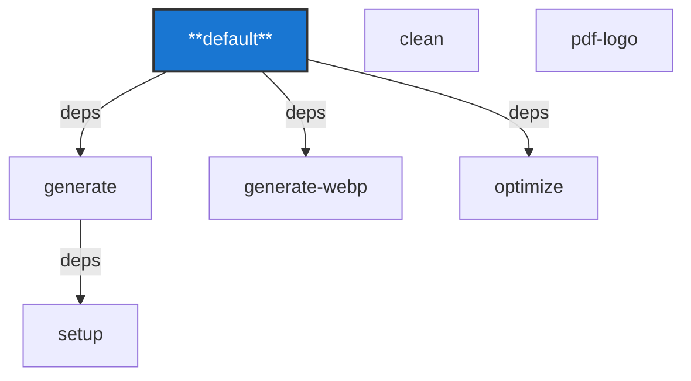

# Taskfile Workflow Diagram

This diagram visualizes the dependencies and flow between tasks defined in `Taskfile.yml` :

## Task Goals and Descriptions

| Task Name     | Description                                                                                       |
|-------------- |---------------------------------------------------------------------------------------------------|
| default       | This Taskfile dynamically creates PNG and JPEG image assets from SVG source files. Run 'task generate' to create them. |
| setup         | Check for required tools (svgexport, convert, optipng, jpegoptim)                                 |
| generate      | Generate PNG and JPEG versions of the logos from SVG files                                        |
| clean         | Remove all generated files                                                                        |
| pdf-logo      | Compile the LaTeX logo into a PDF and clean up auxiliary files                                    |
| generate-webp | Generate WebP versions of the logos from PNG files                                                |
| optimize      | Optimize the size of generated PNG and JPEG files                                                 |

---

Copy and paste the Mermaid code into a Markdown viewer that supports Mermaid to see the graph rendered visually.